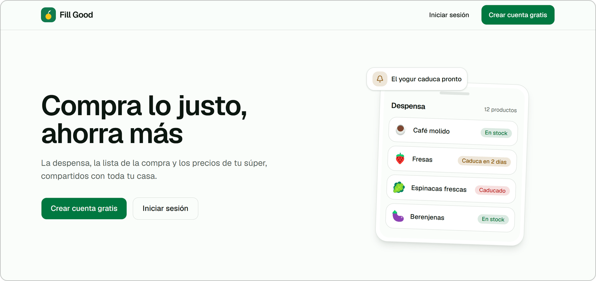
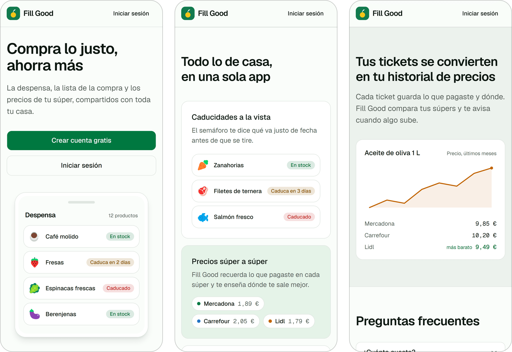

<p align="center">
  
</p>

<h1 align="center">Fill Good</h1>

<p align="center">
  Compra lo justo, ahorra más<br>
  <a href="https://fillgood.jorgemolinafuster.com">fillgood.jorgemolinafuster.com</a>
</p>

Fill Good es una app web instalable para llevar la casa entre varias personas:
qué hay en la despensa y cuándo caduca, qué falta en la lista de la compra,
cuánto costó cada cosa en cada súper y qué se come esta semana. La foto del
ticket al salir del súper pone al día la despensa y el historial de precios de
una vez.

Está en producción desde julio de 2026. La interfaz está en español y se diseñó
primero para el móvil; en escritorio, la barra inferior pasa a ser un panel
lateral y las hojas que suben desde abajo, diálogos centrados.

<picture>
  <source media="(prefers-color-scheme: dark)" srcset="docs/capturas/escritorio-oscuro.png">
  
</picture>

## Qué hace

- Haces una foto del ticket (o subes el PDF, o lo compartes desde otra app) y
  Gemini lo convierte en productos con cantidad y precio. Lo revisas, lo
  confirmas y entra en la despensa y en el historial de precios. Los nombres que
  corriges se recuerdan para el siguiente ticket.
- La despensa marca con un semáforo lo que caduca y, si activas las
  notificaciones, avisa cada mañana. Una vez por semana pregunta por un máximo de
  ocho productos que llevan tiempo sin tocarse, porque fuera de los tickets y del
  modo cocinado nadie apunta el yogur que se come.
- La lista de la compra se comparte con toda la casa y los cambios llegan al
  momento a todos los móviles. Tiene modo compra y sugiere lo que se está
  acabando.
- Cada compra queda en el historial del producto, súper a súper, y la app señala
  dónde sale más barato. El perfil enseña el gasto del mes frente al presupuesto
  del hogar, y el día 1 un aviso lleva al resumen del mes que acaba de cerrarse.
- Gemini propone el menú de la semana con el recetario del hogar, lo que hay en
  casa y lo que ya está en la lista, y respeta reglas del tipo «lentejas al
  menos una vez por semana». La app calcula lo que cuesta la semana y apunta en
  la lista lo que falta.
- Las recetas tienen modo cocinado: paso a paso, con temporizadores sacados del
  propio texto, y al terminar propone qué descontar de la despensa. La IA rellena
  las cantidades y los pasos que falten.
- Un hogar se comparte con un código de invitación, y una misma persona puede
  estar en varios.
- La skill de Alexa, de momento en modo desarrollo, lleva la despensa sin tocar
  el móvil: «Alexa, dile a mi despensa que reste dos yogures».
- Antes de mandar nada a Gemini, la app pide consentimiento, porque en el plan
  gratuito Google puede revisar lo que recibe y entrenar con ello. De las fotos
  se quitan antes los metadatos, ubicación incluida. Los datos se pueden
  exportar y la cuenta se borra desde los ajustes.

<picture>
  <source media="(prefers-color-scheme: dark)" srcset="docs/capturas/movil-oscuro.png">
  
</picture>

<sub>Capturas de la portada pública, con datos de ejemplo. El resto de la app necesita cuenta.</sub>

## Stack

- Next.js 16 con App Router, Server Components y Server Actions, sobre React 19
  y TypeScript.
- Tailwind CSS 4 y shadcn/ui, con tokens semánticos para los dos temas.
- Supabase: Postgres con Row Level Security por hogar, y Realtime para la lista.
- Clerk para la autenticación, conectado a Supabase con su integración nativa:
  las políticas de RLS evalúan el propio token de Clerk.
- Vercel AI SDK con Gemini en el plan gratuito: 3.5 Flash para menús y recetas,
  3.5 Flash-Lite para tickets. El modelo de cada tarea se cambia con una
  variable de entorno.
- Serwist para la PWA (instalación, página sin conexión y compartir tickets
  desde otras apps) y Web Push para los avisos.
- Vercel y Supabase en Fráncfort, con Vercel Cron para los avisos de caducidad y
  el resumen mensual.

Las lecturas van en Server Components y las escrituras en Server Actions. Toda
consulta a una tabla con `household_id` filtra además por el hogar activo: la
RLS solo comprueba que eres miembro, y quien está en dos hogares vería las filas
de los dos mezcladas.

## Algunas decisiones

**El calendario es el de España, corra donde corra el código.** El servidor está
en UTC y el móvil en Madrid. Mientras cada uno leyó su propio reloj, entre las
00:00 y las 02:00 las pantallas se contradecían: la interfaz ofrecía «Lo
cocinamos» y la acción respondía que ese día todavía no había pasado. Ahora
todas las fechas salen de `src/lib/dates.ts`, y `npm run check:fechas` lo
comprueba en UTC, Madrid y Nueva York, porque en un portátil español el fallo
no existe. Rompiendo la función a propósito, salen 0 fallos en Madrid y 11 en
UTC.

**Un `export type` tumbó toda la IA en producción.** En un módulo
`"use server"`, Next.js trata cada exportación como una acción, y un
`export type { X };` sin `from` apunta a algo que TypeScript ya ha borrado. El
módulo muere al evaluarse y se lleva por delante todas las acciones de las
páginas que lo importan. `tsc`, el lint y `next build` lo dieron por bueno,
porque el módulo no se evalúa hasta que alguien pulsa un botón. Desde entonces
`npm run check:acciones` va en el CI.

**La lista de la compra es del cliente.** Con dos personas cambiándola a la vez,
recargar la ruta en cada cambio daba tirones y resucitaba cosas, como la
respuesta tardía del servidor que devolvía lo que acababas de quitar. El
servidor manda cambios de una fila, las instantáneas completas se funden con las
reglas de `list-sync.ts` y `npm run check:lista` reproduce las carreras que
rompían la lista.

**Un cambio de modelo se mide antes de hacerlo.** `npm run compare:menu` genera
semanas reales con varios modelos, con el mismo prompt y el schema de
producción, y las puntúa con el código del repo, sin que ningún modelo juzgue a
otro. En agosto de 2026, Gemini 3.6 Flash empató con 3.5 en todo lo que se
podía contar, pero tardó entre 35 y 105 segundos por menú frente a 31–38, y la
Server Action corta a los 60. Se quedó 3.5. De paso salieron tres fallos del
prompt, dos de ellos tapados por un rescate silencioso.

**El nombre de una línea de ticket es la clave con la que se reconoce el
producto.** Con el peso y el importe dentro, 119 de los 125 nombres aprendidos
de un hogar no podían volver a coincidir nunca. `src/lib/receipt-label.ts`
recorta lo que añade la báscula y deja el gramaje del nombre comercial
(`ESPIRALES 500G` se queda, `0,990 kg x 2,29 €/kg` se va), y
`npm run check:rotulos` lo fija con líneas reales de Mercadona, Alipende y
tickets en catalán.

[AGENTS.md](AGENTS.md) cuenta el porqué de estas y del resto de reglas, con los
fallos que las motivaron.

## Calidad

Cada push a `main` y cada pull request pasan por tres trabajos de CI: lint y
tipos, comprobaciones de reglas, y build de producción con presupuesto de
bundle.

El lint lleva `jsx-a11y` en modo estricto y no admite ni un aviso, así que una
regresión de accesibilidad rompe el CI. Lo que el lint no ve de WCAG 2.2 AA (el
foco, el contraste real en los dos temas, los objetivos táctiles de 44 px) se
revisa a mano.

Las comprobaciones `check:*` ejecutan el TypeScript del repo con Supabase y
Clerk falseados, sin base de datos ni credenciales, y tardan segundos. Cada una
defiende una regla que ni el compilador ni el lint pueden ver:

| Comprobación | Qué defiende |
| --- | --- |
| `check:fechas` | El calendario español, ejecutado en tres zonas horarias |
| `check:lista` | La lista compartida frente a respuestas tardías y cambios cruzados |
| `check:guardas` | Server Actions reales: no pisan lo ya cocinado ni dan por hecha una escritura que no tocó nada |
| `check:menu` | Lo que sabe la IA antes de planificar y las reglas que reescriben la semana |
| `check:cocinado` | Cuánto se descuenta de la despensa al cocinar, y en qué unidad |
| `check:cocina` | El modo cocinado: por dónde se retoma, qué ofrece al terminar y qué tiempos detecta |
| `check:repaso` | Por qué productos pregunta el repaso semanal de despensa |
| `check:motivos` | El texto que explica por qué se sugiere algo en la lista |
| `check:rotulos` | La clave con la que se reconocen los nombres de los tickets |
| `check:receta-ia` | Que la IA complete cantidades sin renombrar los ingredientes |
| `check:alexa` | El estado de la conversación con Alexa |
| `check:acciones` | Que un módulo `"use server"` solo exporte acciones |

`check:bundle` compara con un presupuesto el JavaScript que comparten todas las
rutas y el de cada layout, y `check:legal` impide desplegar los textos legales
sin los datos del responsable.

Antes de cualquier `git push` que lance Claude Code, un hook ejecuta el build de
producción con esas comprobaciones y bloquea la subida si falla, porque `main`
despliega directo a producción.

## Estructura

```
src/app/                  Rutas (App Router); (app)/ es la parte con sesión
src/features/<feature>/   components/, actions.ts, queries.ts y schemas.ts
src/components/           UI compartida; ui/ son los componentes de shadcn
src/lib/                  Clientes de Supabase, IA, fechas, medición de uso…
supabase/migrations/      Esquema, políticas de RLS y funciones
scripts/                  Las comprobaciones check:* y utilidades
docs/                     Skill de Alexa, especificaciones y planes ya cerrados
```

## Ejecutarlo en local

El repo está publicado para enseñarlo, pero se puede arrancar. Hace falta
Node 24 y cuentas gratuitas en Supabase, Clerk y
[Google AI Studio](https://aistudio.google.com/apikey).

```bash
npm ci
cp .env.example .env.local        # cada variable lleva su explicación
npx supabase login
npx supabase link --project-ref <tu-proyecto>
npx supabase db push              # aplica las migraciones
npm run dev
```

Clerk se conecta a Supabase como proveedor externo de autenticación
([guía de Supabase](https://supabase.com/docs/guides/auth/third-party/clerk)).
Las notificaciones y Alexa son opcionales: sin sus variables quedan apagadas. La
skill tiene su propia guía en [docs/alexa](docs/alexa/README.md).

## Documentación

[AGENTS.md](AGENTS.md) es la documentación técnica: convenciones, reglas del
sistema de diseño y qué vigila cada comprobación. Es también la guía que lee
Claude Code, con el que se desarrolla el proyecto. En `docs/historico/` quedan
los planes ya ejecutados, como registro de cómo se decidió cada cosa.

## Licencia

El código es público para que se pueda leer, pero no tiene licencia de uso:
todos los derechos reservados ([LICENSE](LICENSE)).

Los iconos de producto son de
[Fluent Emoji](https://github.com/microsoft/fluentui-emoji), de Microsoft, con
licencia MIT, salvo 14 dibujados para la app en `assets/product-icons/`. Sus
avisos de licencia, y los de los componentes de shadcn/ui, están en
[THIRD-PARTY-NOTICES.md](THIRD-PARTY-NOTICES.md).
